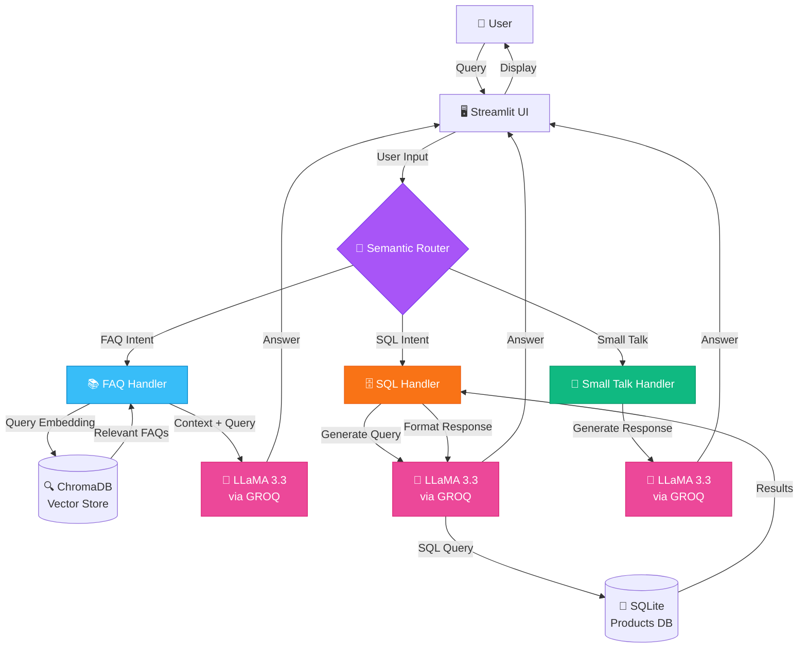
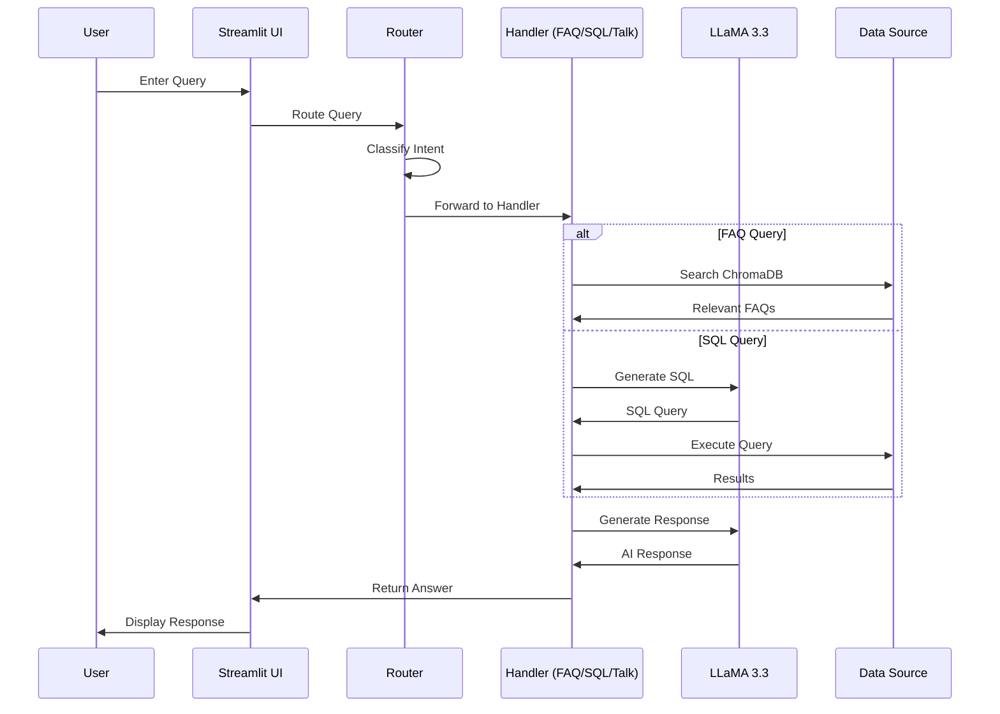
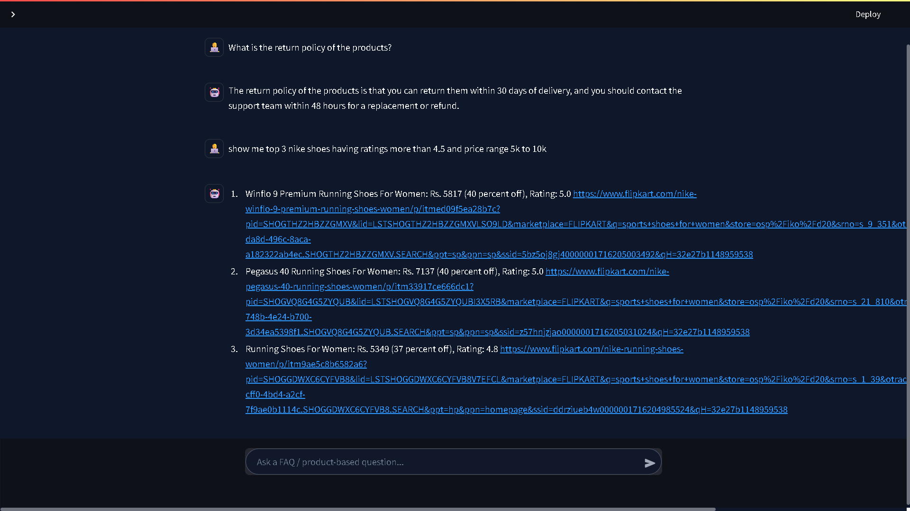

<div align="center">

# 🛒 E-Commerce Chatbot

### *Intelligent AI-Powered Shopping Assistant*

[](https://www.python.org/downloads/)
[](https://streamlit.io/)
[](https://ai.meta.com/llama/)
[](https://groq.com/)
[](LICENSE)

**A cutting-edge Generative AI chatbot that revolutionizes e-commerce customer experience through intelligent query understanding and real-time database integration.**

[Features](#-features) • [Architecture](#-architecture) • [Installation](#-installation) • [Usage](#-usage) • [Tech Stack](#-technology-stack)

</div>

---

## 📖 Overview

This project is a **Proof of Concept (POC)** for an intelligent e-commerce chatbot that seamlessly handles customer queries by understanding intent and providing accurate, context-aware responses. Built with **LLaMA 3.3** and powered by **GROQ**, this chatbot combines the power of:

- 🧠 **RAG (Retrieval-Augmented Generation)** for FAQ handling
- 🗄️ **Natural Language to SQL** for product queries
- 💬 **Small Talk** capabilities for engaging conversations
- 🎯 **Semantic Routing** for intelligent intent classification

---

## ✨ Features

### 🎯 **Intelligent Intent Recognition**
The chatbot automatically identifies user intent and routes queries to the appropriate handler:

| Intent | Description | Example Query |
|--------|-------------|---------------|
| **FAQ** | Answers policy and general questions using RAG | *"What is your return policy?"* |
| **SQL** | Retrieves product information from database | *"Show me Nike shoes under ₹3000"* |
| **Small Talk** | Handles casual conversation | *"Hello! How are you?"* |

### 🚀 **Key Capabilities**

- ✅ **Real-time Database Access** - Live product information retrieval
- ✅ **Semantic Search** - ChromaDB-powered FAQ matching
- ✅ **Natural Language SQL** - Convert questions to SQL queries automatically
- ✅ **Context-Aware Responses** - Understands nuanced queries
- ✅ **Beautiful UI** - Modern Streamlit interface with dark theme
- ✅ **Scalable Architecture** - Modular design for easy extension

---

## 🏗️ Architecture

### System Architecture Diagram




### 🔄 Query Flow



---

## 💻 Technology Stack

<table>
<tr>
<td width="50%">

### **Core Technologies**
- 🐍 **Python 3.8+** - Programming language
- 🎨 **Streamlit 1.39.0** - Web UI framework
- 🤖 **LLaMA 3.3** - Large language model
- ⚡ **GROQ** - Ultra-fast LLM inference

</td>
<td width="50%">

### **AI & Data**
- 🔍 **ChromaDB** - Vector database
- 🧭 **Semantic Router** - Intent classification
- 📊 **Pandas** - Data manipulation
- 🗄️ **SQLite** - Product database

</td>
</tr>
</table>

### 📦 Dependencies

```
streamlit==1.39.0
pandas==2.2.3
pandasql==0.7.3
python-dotenv==1.0.1
groq==0.11.0
semantic-router[local]==0.3.8
chromadb==0.5.4
sentence-transformers==3.2.0
```

---

## 🚀 Installation

### Prerequisites

- Python 3.8 or higher
- pip package manager
- GROQ API key ([Get one here](https://console.groq.com/))

### Step-by-Step Setup

1️⃣ **Clone the Repository**
```bash
git clone <repository-url>
cd Project-E-Commerce-Chatbot
```

2️⃣ **Install Dependencies**
```bash
pip install -r requirements.txt
```

3️⃣ **Configure Environment Variables**

Create a `.env` file in the project root directory:

```env
GROQ_MODEL=llama-3.3-70b-versatile
GROQ_API_KEY=your_groq_api_key_here
```

> 💡 **Tip**: You can get your GROQ API key from [https://console.groq.com/](https://console.groq.com/)

4️⃣ **Run the Application**
```bash
streamlit run app/main.py
```

The application will open in your default browser at `http://localhost:8501`

---

## 📱 Usage

### Example Queries

#### 💬 FAQ Questions
```
❓ What is your return policy?
❓ Do you accept cash on delivery?
❓ How can I track my order?
❓ What payment methods are accepted?
❓ How long does it take to process a refund?
```

#### 👟 Product Queries
```
🛍️ Show me Nike shoes under ₹3000
🛍️ I want to buy Puma shoes with 50% discount
🛍️ Are there any formal shoes in size 9?
🛍️ Find running shoes with rating above 4.5
🛍️ What is the price of Adidas sneakers?
```

#### 💬 Small Talk
```
👋 Hello!
👋 How are you?
👋 Thank you!
```

### 🎬 Demo



---

## 📁 Project Structure

```
Project-E-Commerce-Chatbot/
│
├── 📂 app/                          # Main application directory
│   ├── 📄 main.py                   # Streamlit UI and main application
│   ├── 📄 router.py                 # Semantic routing logic
│   ├── 📄 faq.py                    # FAQ handler with RAG
│   ├── 📄 sql.py                    # SQL query generation & execution
│   ├── 📄 smalltalk.py              # Small talk handler
│   ├── 📄 db.sqlite                 # Product database
│   │
│   └── 📂 resources/                # Static resources
│       ├── 📄 faq_data.csv          # FAQ knowledge base
│       ├── 📄 ecommerce_data_final.csv  # Product data
│       ├── 🖼️ product-ss.png        # Screenshot
│       └── 🖼️ architecture-diagram.png  # Architecture diagram
│
├── 📂 Web Scraping/                 # Data collection scripts
│   └── 📓 flipkart_data_extraction.ipynb
│
├── 📄 requirements.txt              # Python dependencies
├── 📄 README.md                     # This file
├── 📄 .env                          # Environment variables (create this)
└── 📄 Flipkart_Chatbot_SOW.pdf     # Statement of Work
```

---

## 🔧 How It Works

### 1️⃣ **Intent Classification (Semantic Router)**

The `router.py` module uses semantic similarity to classify user queries into three categories:
- **FAQ**: Questions about policies, shipping, returns, etc.
- **SQL**: Product search and information requests
- **Small Talk**: Greetings and casual conversation

### 2️⃣ **FAQ Handler (RAG Pipeline)**

```python
User Query → Embedding → ChromaDB Search → Retrieve FAQs → LLM Generation → Answer
```

- Embeds user query using `sentence-transformers`
- Searches ChromaDB for semantically similar FAQs
- Passes relevant context to LLaMA 3.3 for answer generation

### 3️⃣ **SQL Handler (Text-to-SQL)**

```python
User Query → LLM (Generate SQL) → Execute Query → Format Results → LLM (Natural Response) → Answer
```

- Converts natural language to SQL using LLaMA 3.3
- Executes query on SQLite database
- Formats results into natural language response

### 4️⃣ **Small Talk Handler**

Simple conversational responses for greetings and casual interactions.

---

## 🎨 UI Features

- 🌙 **Dark Theme** - Modern, eye-friendly interface
- 💬 **Chat Interface** - Familiar messaging experience
- 🎯 **Example Queries** - Sidebar with sample questions
- 🚀 **Fast Responses** - GROQ-powered ultra-fast inference
- 📱 **Responsive Design** - Works on all screen sizes

---

## 🛠️ Customization

### Adding New FAQs

Edit `app/resources/faq_data.csv`:
```csv
question,answer
"What is your shipping policy?","We offer free shipping on orders above ₹500..."
```

### Modifying Database Schema

The product database schema is defined in `app/sql.py`:
```sql
table: product
fields: product_link, title, brand, price, discount, avg_rating, total_ratings
```

### Changing LLM Model

Update `.env` file:
```env
GROQ_MODEL=llama-3.1-70b-versatile  # or any other GROQ model
```

---

## 🐛 Troubleshooting

### Common Issues

**Issue**: `ModuleNotFoundError: No module named 'streamlit'`
- **Solution**: Run `pip install -r requirements.txt`

**Issue**: `GROQ API Key not found`
- **Solution**: Ensure `.env` file exists with valid `GROQ_API_KEY`

**Issue**: ChromaDB collection errors
- **Solution**: Delete ChromaDB cache and restart the application

---

## 🤝 Contributing

Contributions are welcome! Please feel free to submit a Pull Request.

1. Fork the repository
2. Create your feature branch (`git checkout -b feature/AmazingFeature`)
3. Commit your changes (`git commit -m 'Add some AmazingFeature'`)
4. Push to the branch (`git push origin feature/AmazingFeature`)
5. Open a Pull Request

---

## 📄 License

This software is licensed under the **MIT License**. However, commercial use of this software is strictly prohibited without prior written permission from the author. Attribution must be given in all copies or substantial portions of the software.

---

## 🙏 Acknowledgments

- **LLaMA 3.3** by Meta AI
- **GROQ** for ultra-fast inference
- **Streamlit** for the amazing UI framework
- **ChromaDB** for vector storage
- **Codebasics** for the project foundation

---

<div align="center">

### ⭐ If you found this project helpful, please give it a star!

**Made with ❤️ and 🤖 AI**

</div>